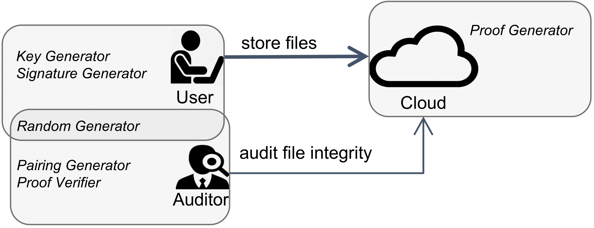
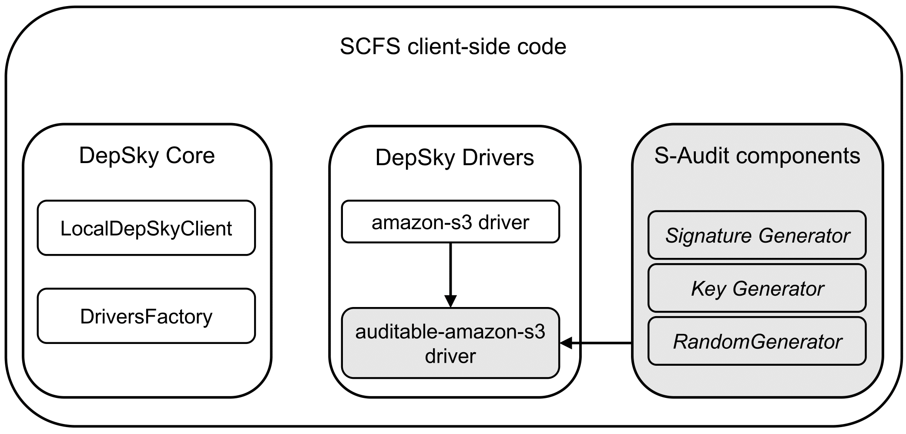

# S-Audit

S-Audit is the SafeCloud integrity verification service. 
The [SafeCloud project](https://www.safecloud-project.eu/) developed security solutions intended to be secure even against powerful, motivated and well-funded adversaries.

For more information about S-Audit please see the publication:

Filipe Apolinário, Miguel L. Pardal, and Miguel Correia. *S-Audit: Efficient Data Integrity Verification for Cloud Storage*. In Proceedings of the 17th IEEE International Conference On Trust, Security And Privacy In Computing And Communications (IEEE TrustCom-18), July 2018.

[BibTeX file for citation](doc/S-Audit.bib)

***

S-Audit software library provides integrity verification of data stored in commercial clouds. It uses homomorphic authentication with digital signatures to avoid retrieving the protected data from the cloud.  The service was integrated with a cloud-backed file system called SCFS to show how it can be used in practice.  
    
S-Audit leverages *homomorphic digital signatures* for integrity control of the stored data, and the computation resources of commercial clouds infrastructures for executing code and generating compact integrity proofs based on the data and signatures present in the cloud storage.  
Also, by requesting and verifying these small proofs, cloud-backed applications can perform storage integrity control without being constrained by network bandwidth limitations or having to download large quantities of data.

This software library is developed in Java and all the pairing-based cryptographic mechanisms were implemented using the Java Pairing-Based Cryptography Library (JPBC), which implements multi-linear maps and the operations that manipulate them. 

## Getting Started
In order to preserve the integrity of the data stored on the cloud, %using \textsc{S-Audit}, 
the entities involved 
-- cloud, user and auditor -- 
need to follow the *S-Audit interaction protocol* described herein.
The protocol is divided into four tasks: setup, store data, request and verify integrity proof, and generate integrity proof.

These instructions will get you a copy of the project up and running on your local machine for development and testing purposes. See deployment for notes on how to deploy the project on a live system.

Auditors use the Pairing Generator component to generate the setup parameters for pairing-based cryptography. 
Users utilize the Key Generator component to generate their asymmetric secret/public key pair and signature parameter *w*; and use the *Signature Generator* component to sign their data. 
Both these entities use the \textit{Random Generator} component to generate random numbers belonging to any field of their choosing (Z_p, G or G_T).

Clouds run the Proof Generator component to generate integrity proofs. 
Auditors use the Proof Verifier component to verify the proofs obtained from the cloud.

### Setup

Before storing any data in the cloud, the user and auditor must perform the following protocol steps:

1. The user and the auditor exchange data. 
The auditor provides two files\footnotemark~to the user for setting-up pairing-based cryptography: 
the .param file with all the secure public initialization parameters needed for configuring cyclic groups *G*, *G_T* and the pairing for mapping *G x G -> G_T*; and 
the .g file with generator *g* of the cyclic group *G*. 
The user provides configuration information to the auditor about 
the time when each audit should be performed (e.g., daily, weekly), and other settings.

2. The user generates his secret/public asymmetric key pair and the signature parameter (*w*) for signing and verifying data under the SW scheme, using respectively the S-Audit's key and random number generators.

3. The user shares the public key and *w* with auditor and stores w on the cloud.

4. The user configures the cloud for listening to requests from the auditor requests and for responding to them, with the execution of S-Audit's  the proof generator service.

After these steps are performed users can now store their data in the cloud, as explained next.

#### Random Number Generator

This component allows generation of random numbers belonging to any of Z_p, G or G_T fields. 
To do so, this generator receives as inputs the desired field, the pairing .param and the .g and outputs the random number.  

#### Pairing Generator

This component allows auditors to construct setup parameters .param and .g for initializing pairing-based cryptography, according to their security specification.

Auditors provide as input the type of pairing curve to be used for pairing generation, and the parameters needed for initializing the curves.

The Pairing Generator outputs: a specifier file .param detailing all the information about the multiplicative cyclic groups *G* and *G_T*, the integer range of the *Z* integers used for generating elements, and the pairing specifications for mapping *G* to *G_T*; and the generator file .g  containing the absolute value of the element used for generating the multiplicative group *G*.

#### Key Generator

The Key Generator component allows users to generate their own asymmetric key pair and signature parameter according to the security information provided by the auditor. The generated keys are used for the BLS and SW schemes. 

The generator works as follows: 
the user inputs the setup parameters provided by the auditor .param and .g; 
the component initializes the pairing; 
generates the secret key by selecting a random number belonging to *Z_p*; 
generates the public key by computing *g^{sk}*; 
generates the signature parameter by selecting a random number belonging to *G*;  
and returns the keys and *w* to the user. 
### Sign

When the user stores data in the cloud, all data must be divided into blocks belonging to *Z_p* and signed. 
The %\textsc{S-Audit}'s *signature generator* (further explained in Section \ref{archsec}) automates these tasks and produces a signature equivalent to the SW Block Signature step. 
To do so, the client provides as input for the signature generator: the data and its identifier (e.g., the file content of the  data.txt file is used as the data and the identifier is the file name), alongside with the pairing cryptography parameters ('.param' and .g files), secret key (.sk), and the signature parameter (.w); and obtains the signature of all the data blocks. 

After the signature of the data is obtained, the user stores both the data and signature in the cloud. Data can now be verified.

#### Storage Tagger - Signature Generator

The Signature Generator component allows clients to sign data using %the signing step of the SW scheme. 

In the SW scheme, the data to be signed is assumed to have fixed sizes and belongs to *Z_p*. 
To support data sizes bigger than original data, users have to divide the data in blocks that belong to *Z_p*, and sign each block individually. 
In order to automate data division into *Z_p* data blocks and sign each of them with the SW scheme, the **Signature Generator** supports two signing modes: the Sign-Block mode, for signing individual data blocks in *Z_p*; and the Sign-Data mode, that converts all the input data to one or more blocks *\in* *Z_p*, signs each block using the Sign Block component, and returns the concatenation of all generated signatures from the blocks.
### Verify

Divided into two parts: Auditor and cloud.
#### Auditor: Request and Verify Integrity Proof

The auditor is responsible for integrity verification. 
To do so, whenever the auditor wants to obtain integrity proofs of a file stored on the cloud, it must perform the following steps:

1. Select a file composed of *x* data elements (vector *[0,...,x-1]*).

2. Generate a random challenge (number belonging to *Z_p*) for each of the *x* data elements chosen, using the random number generator.

3. Issue the integrity proof request to the cloud specifying the identifiers vector (*[id_0,...,id_x]*) and the corresponding challenge vector (*[chal_0,...,chal_x]*). 

4. Upon receiving a response from the cloud with the requested integrity proof, the auditor verifies it using the S-Audit's 
**proof verifier**. 
The auditor provides the public key *pk* and the signature parameter *w*, alongside with the identifiers and challenges used on the integrity request, and obtains the integrity verification result. 
This step corresponds to the Proof Verification step of the SW scheme.  

##### Proof Verifier

The **Proof Verifier** component allows users to verify integrity proofs, using the SW proof verification step. 
To do so, the algorithm first initializes pairing with the setup parameters (.param  and .g); applies g pairing to *\beta*, multiplies all identifiers present in the proof with *w^{\alpha}*, applies public key pairing to the identifier and *\alpha* multiplication and verifies if both pairings obtained a match. If so, the data integrity is preserved.

#### Cloud: Generate Integrity Proof
Whenever the cloud receives an integrity proof request for a given file, it performs the following steps: 

1. Fetch all the data and signatures of the file from the storage cloud corresponding to the identifiers specified. 

2. Fetch from the storage cloud, the pairing cryptography parameters ( .param\ and .g), and the signature parameter (.w), of the user requested. 

3. Generate integrity proof, composed of:  
aggregation of signatures provided (*beta*); and aggregation of data provided (*alpha*), by using S-Audit's the **proof generator**. 
The generator receives data, setup parameters (.g\ and .param), signatures, challenges, pairing cryptography parameters and the random initialization parameter related to the file; and produces the *alpha* and *beta*. This step corresponds to the proof generation step of the SW scheme. 

4. Respond to requester with the integrity proof (*alpha* and *beta*). 

##### Proof Generator

The **Proof Generator** component is the only one that is executed in the cloud. 
It allows clouds to generate integrity proofs with the files they have stored whenever an auditor requests them. 
To do so, the algorithm first initializes pairing with the setup parameters, then calculates *\alpha* and *\beta* based on the data's blocks present in the file.
To simplify the deployment and to reduce the cost of running the **Proof Generator} in a cloud, we leverage recent services that implement the FaaS %, serverless computing, or lambda model. 
The alternative would be to have a virtual machine for this purpose in a cloud compute service (e.g., Amazon EC2), but it would be costly to run it permanently in the cloud, or to store an image there to run it when necessary. 
The FaaS model allows the execution of a code component (a function) in a cloud upon a certain event, in our case, the reception of a request through a REST API. % in our case. 
In this model, the users pay only for the time and resources used when the function is executed, not when it is idle. Therefore, it is possible to have S-Audit's 
the **Proof Generator** component always ready to run in the cloud without costs when it is not running. 

## Extending SCFS with S-Audit

S-Audit was designed to allow easy integration with existing cloud-backed applications.
As a proof of concept, the S-Audit components described in Section \ref{archsec} were integrated with the Shared Cloud-backed File System (SCFS).

SCFS is a distributed file system that stores files in a cloud or a set of clouds (a cloud of clouds). 

Users mount the SCFS file system on a folder of their device, and the SCFS client-side component synchronizes files with the cloud storage services. 
SCFS supports data sharing among several users, automatically propagating users' modifications between them.

In the integration we have to consider the three S-Audit entities:
* The user code is integrated with the client-side code of SCFS;
* The auditor code is a stand-alone Java program;
* The cloud code runs in a FaaS service such as Amazon Lambda.

Next we focus mostly on the first entity, as it is the one truly integrated with SCFS code.

SCFS has two modes: the single-cloud model, where files are stored in a service like Amazon S3; and 
the multiple-cloud model, where files are stored on several clouds using the DepSky software library. 
In this integration, SCFS was configured with DepSky. %and the integration with S-Audit was made through DepSky.
Data integrity is protected in SCFS and DepSky using RSA digital signatures.
This allows users to verify any data present in the cloud storage, but requires users to download the data and the signatures and perform the integrity verification on their device, with both monetary costs and delays.

The user components of S-Audit were integrated in DepSky's component responsible for uploading data into the cloud. 
The logic for communicating with different commercial clouds is implemented in subcomponents called cloud drivers. 
Since the integration of S-Audit should not break any of the features currently supported by DepSky or SCFS, integrating both systems required code changes to DepSky, in a contained way. 
The followed approach was the addition of a new type of cloud driver: the _auditable cloud driver_. 

With these newly introduced cloud drivers, besides accessing and uploading data to the cloud, data is signed using S-Audit's signature generator and the signature is also stored on the cloud. 
As seen in the Figure, for integrating these new drivers, DepSky was modified in  two packages: core and drivers. 
Code was added to the core package of DepSky, in the DepSky initialization function (in _LocalDepSkySClient.java_) and to the DepSky driver constructor function (in _DriversFactory.java_).

For using S-Audit, SCFS has to be configured with these \textit{auditable cloud drivers}, which implement the logic of our system. 
For instance, to use Amazon S3 as cloud storage, instead of using the original (non-auditable) driver \textit{amazon-s3}, the corresponding auditable driver \textit{auditable-amazon-s3} was % shall be 
used.
Users can choose which drivers to use, by modifying the configuration file with the name of the desired drivers. 
The DepSky initialization function automatically reads the user's secret key, the setup parameters (`.param' and `.g') and the signature parameters (`.w') provided by the auditor; and 
uses the initialization function of the DepSky driver for initializing the driver with that information. 
Regarding the driver package, the auditable drivers extend the non-auditable drivers. 
Whenever data is uploaded to the commercial cloud using the auditable driver, data is signed by using \textsc{S-Audit}'s sign data component and then both signature and data are uploaded to the commercial cloud by invoking the the non-auditable driver %(superclass) 
code.

## Built With

* [Java](https://www.oracle.com/java/) - Java programming language platform
* [JPBC](http://gas.dia.unisa.it/projects/jpbc/) - Java Pairing Based Cryptography Library 
* [AWSLambda](https://aws.amazon.com/lambda/) - Function execution on the cloud without server configuration and management
* [SCFS](https://github.com/cloud-of-clouds/SCFS) - cloud-backed file system
* [Depsky](https://github.com/cloud-of-clouds/depsky) - cloud-of-clouds library
* [DepSpace](https://github.com/bft-smart/depspace) - tuple space

## Authors

* **Filipe Apolinário** - [f-apolinario](https://github.com/f-apolinario)
* **Miguel L. Pardal** - [miguelpardal](https://github.com/miguelpardal)
* **Miguel Correia** - [mpcorreia](https://github.com/mpcorreia)

See also the list of [contributors](https://github.com/inesc-id/S-Audit/contributors) who participated in this project.

## License

This project is licensed under the MIT License - see the [LICENSE.md](LICENSE.md) file for details

## Acknowledgments

* The SafeCloud project team
* The DepSky and SCFS developers

